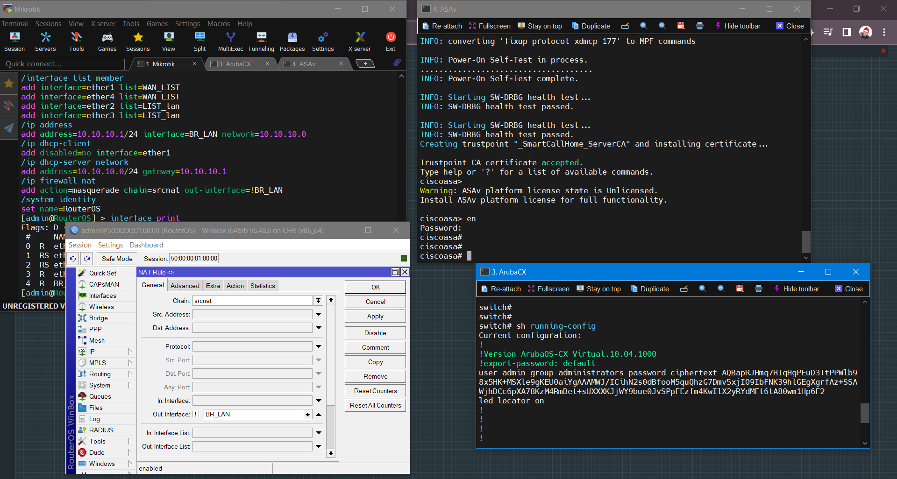

# Network
Labs Network  
Различные лабораторные работы выполненые в среде EVE-NG.
<ul>
  <li>Cisco</li>
  <li>MicroTik</li>
</ul>

В коммите лабы отображена суть использования той или иной технологии.

Готовый образ виртуальной машины для VMware: 
В этом образе коммутаторы и маршрутизаторы CISCO. 
Все лабы которые есть в этом репозитории построены на этой машине.
 Образ обновляется по мере добавления новых сетевых устройств

 

Ссылка для скачивания образа <a href="https://drive.google.com/file/d/1ENE2J-s7kylzUD99wBns05J7LMyXtt49/view?usp=sharing">вот ТУТ!</a>

<h2>Обновился образ!</h2>

Теперь образ содержит железяки

<ul>
  <li>Cisco</li>
  <li>Cisco_ASA</li>
  <li>MikroTik!</li>
  <li>Aruba!</li>
</ul>

 
<h3><a href="https://drive.google.com/file/d/1Qg7PT1HGGLLAmNqGXXVqph_YCtz0r4ry/view?usp=sharing">Зебераем и юзаем - сдесь!</a></h3>

